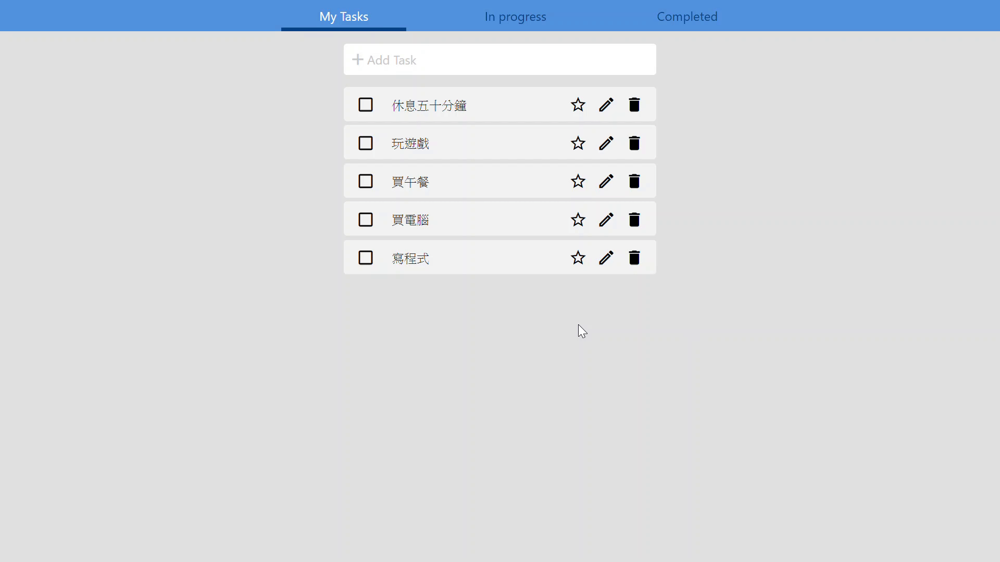
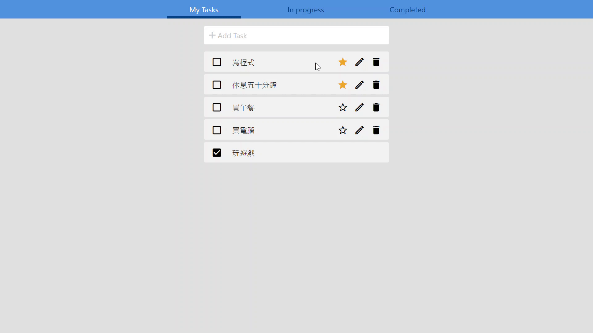
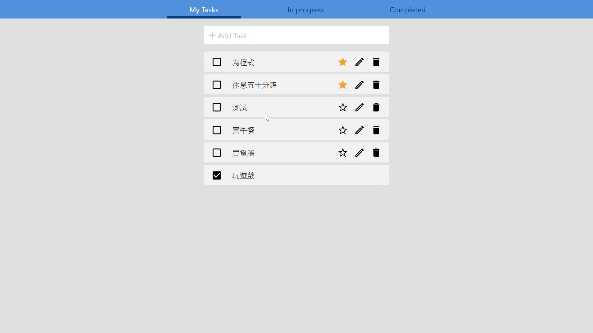

# 運用react及redux來寫簡易的todolist
###### todolist參考設計稿 [連結](https://valuejoe.github.io/todolist_react/)
介面只有以電腦website方式設計，並無測試其他載具。
### 基本功能
-   Add Todo : 新增todo
-   Delete Todo : 刪除todo
-   Edit Todo : 編輯todo
-   Complete Todo : 標記完成的todo
-   Star Todo : 標記重要todo
-   Filter : 將todolist過濾進行中、已完成的分類
-   Todo sortable : 用拖曳方式變動todo的排序
### 運用工具
-   React : 主要使用的前端框架
-   Redux : 資料傳輸使用的API
-   react-sortable-hoc : 用來做todo的拖曳及排序的API
-   CSS : 呈現網頁樣貌
-   webpack :  主要開發環境，用來整合及管理網頁元件
## DEMO 作品展示
 [Todolist demo site](https://valuejoe.github.io/todolist_react/)

#### Star todo 、Complete todo、Delete todo、Filter
 
#### Add todo
 
#### Edit todo
 
#### Todo sortable
 

 ## Installation 安裝

```console
$ git clone https://github.com/valuejoe/todolist_react.git 
$ cd todolist_react
$ npm install 
$ npm start   ## Open the browser at: http://localhost:8080
```
